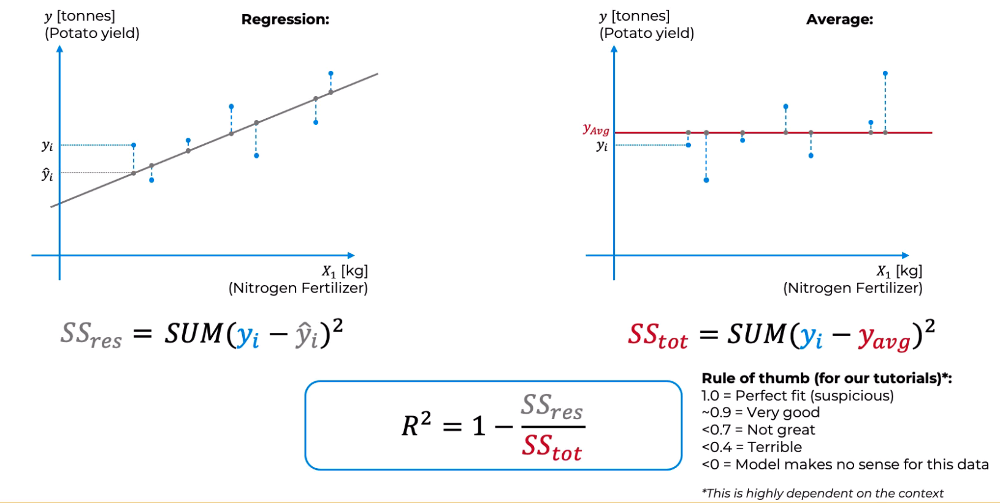
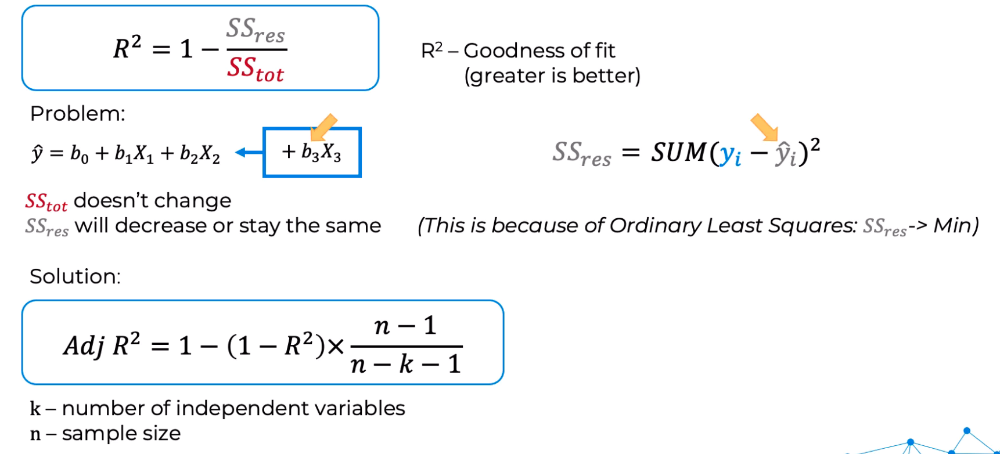

# Regression

Regression models (both linear and non-linear) are used for predicting a real value, like a salary for
example. If your independent variable is time, then you are forecasting future values, otherwise your model
is predicting present but unknown values. Regression technique vary from Linear Regression to SVR and Random

Some examples: 
1. Simple Linear Regression
2. Multiple Linear Regression
3. Polynomial Regression
4. Support Vector for Regression (SVR)
5. Decision Tree Regression
6. Random Forest regression

## Evaluating Regression Models Performance

### R-Squared 

- $R^2$ - Goodness of fit (greater is better)

- Problem: Adding more independent variables will always increase $R^2$ (even if they are not relevant)
- Solution: Adjusted $R^2$ (penalizes for adding more independent variables)

### Adjusted R-Square

$$ Adj R^2 = 1 - \frac{(1-R^2)(n-1)}{n-k-1} $$
k - number of independent variables 
n - sample size

## Regression Model Selection in Python

There are several metrics that can be used to evaluate the performance of a regression model. Some commonly used metrics include:

1. Mean Absolute Error (MAE) - This measures the average magnitude of the errors in a set of predictions, without considering their direction. It's the sum of the absolute differences between the predicted values and the actual values, divided by the number of predictions.

2. Mean Squared Error (MSE) - This measures the average of the squares of the errors. It's the sum of the squares of the differences between the predicted values and the actual values, divided by the number of predictions. MSE is more sensitive to outliers than MAE.

3. Root Mean Squared Error (RMSE) - This is the square root of the MSE. It's used to measure the difference between the predicted values and the actual values in the same units as the target variable.

4. R-squared - This is a statistical measure of how well the regression model fits the data. It ranges from 0 to 1, with a higher value indicating a better fit.

5. Adjusted R-squared - This is a modified version of R-squared that adjusts for the number of predictors in the model. It can be used to compare the fit of different regression models.

6. Mean Absolute Percentage Error (MAPE) - This measures the average magnitude of the errors as a percentage of the actual values. It's the sum of the absolute differences between the predicted values and the actual values, divided by the sum of the actual values, and multiplied by 100.