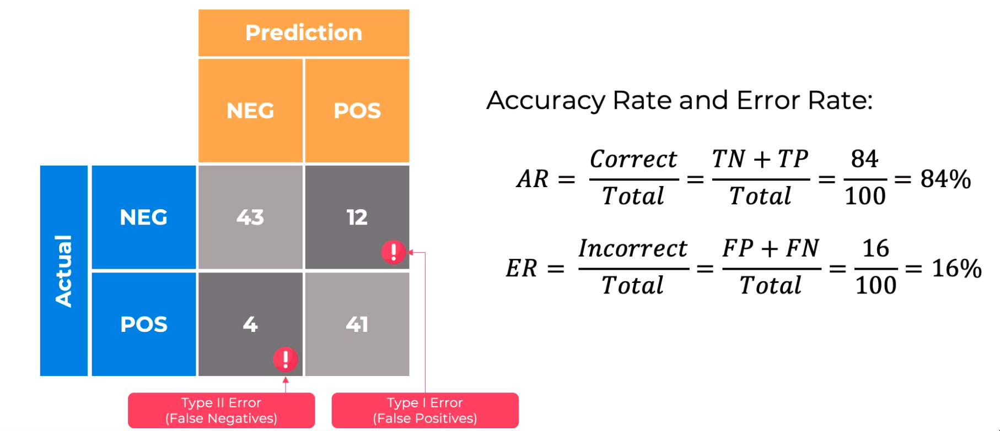
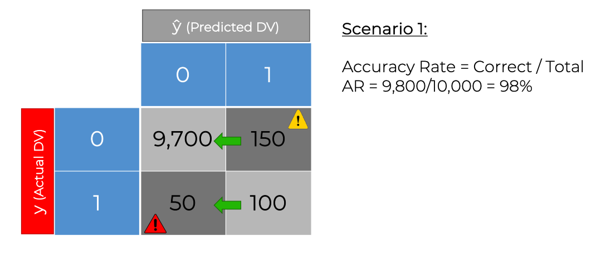
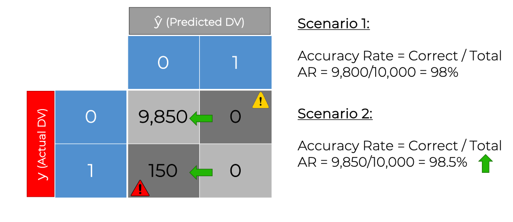
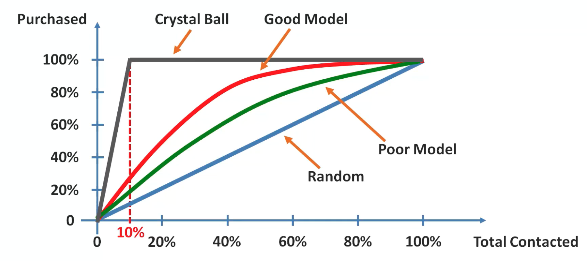
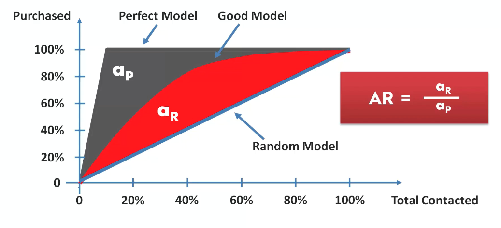

# Classification

Unlike regression where you predict a continuous number, you use classification to predict a **category**.
There is a wide vairety of classification applications from medicine to marketing.
Classification models include linear models like Logistic Regression, SVM, and nonlinear
ones like K-NN, Kernel SVM, and Random Forests.

In this part, you will understand and learn how to implement the:
1. Logistic regression
2. K-Nearest Neighbors (K-NN)
3. Support Vector machine (SVM)
4. Kernel SVM
5. Naive Bayes
6. Decision Tree Classification
7. Random Forest Classification

## Classification Model Selection

### Confusion Matrix & Accuracy

## Evaluating Classification Models Perofrmance

### Accuracy Paradox

### CAP curve

- `CAP` = Cumulative Accuracy Profile

