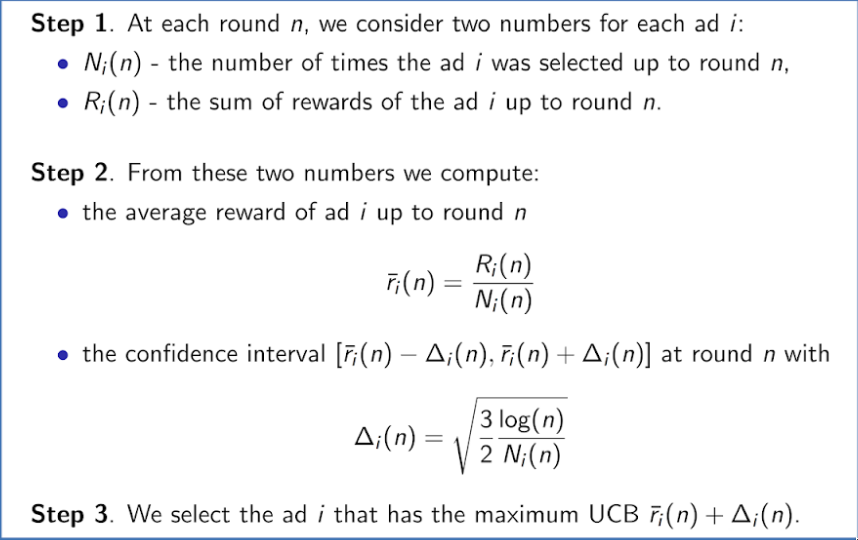

# Reinforcement Learning

Reinforcement Learning is a powerful branch of Machine Learning. It is used to solve interacting problems where the
data observed up to time t is considered to decide which action to take at time t + 1. It is also used
for Artificial Intelligence when training machines to perform tasks such as walking. Desired outcomes provide the
AI with reward, undesired with punishment. Machines learn through trial and error.

In this part you will understand and learn how to implement the following Reinforcement Learning models:

1. Upper Confidence Bound (UCB)
2. Thompson Sampling

## Upper Confidence Bound (UCB)

- We have d arms. For example, arms are ads that we display to usesrs each time they connect to a webpage
- Each time a user connects to this web page, that makes a round.
- At each round n, we choose one ad to siplay to the user.
- At each round n, ad i gives reward $r_i(n) \in \{0,1\}: r_i(n)=1$ if the user clicked on the ad i, 0 otherwise.
- Our goal is to maximize the total reward we get over many rounds.

## Thompson Sampling
