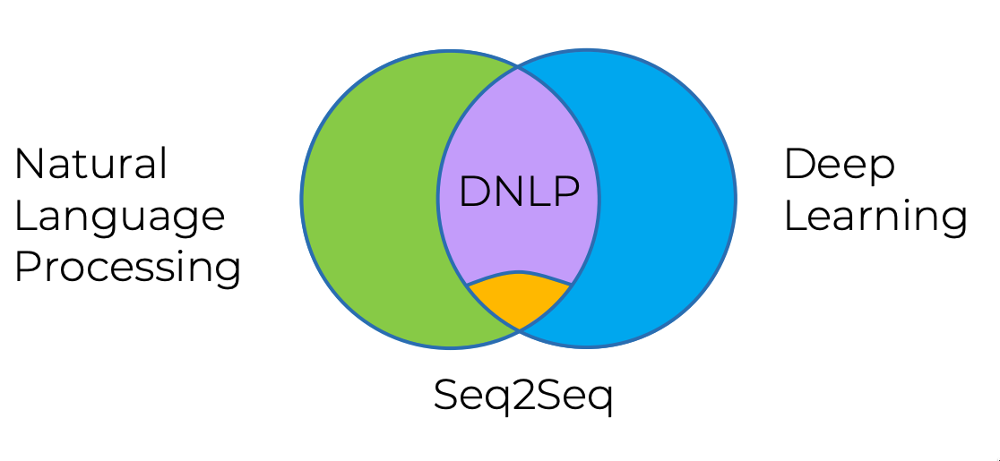
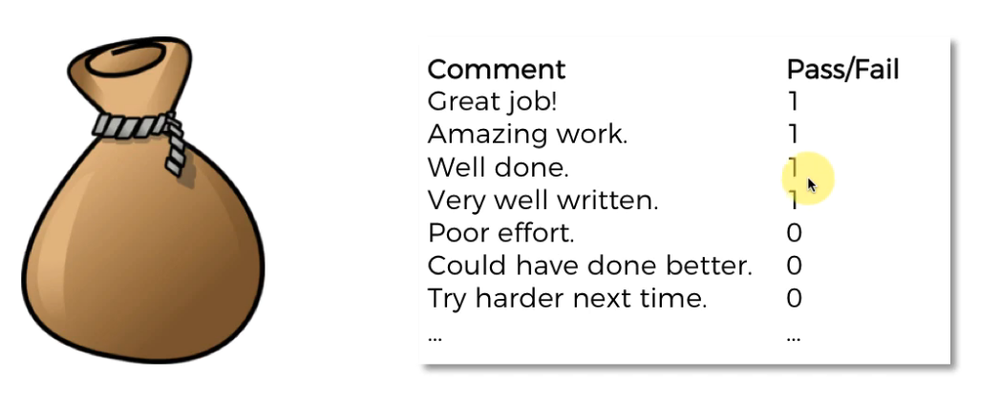
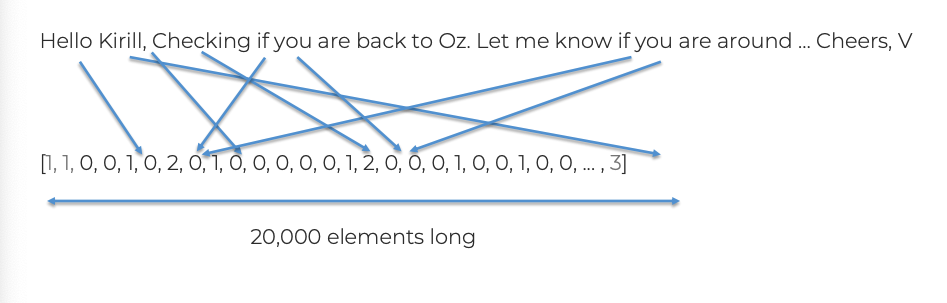
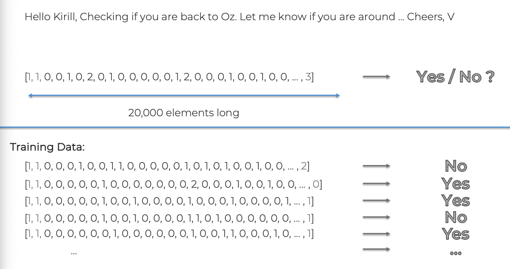
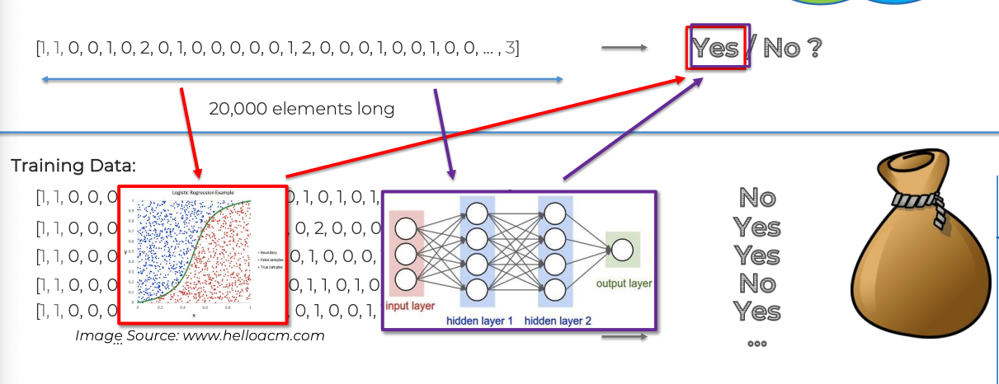

`Natural Language PRocessing (NLP)` is a applying Machine Learning models to text and language. Teaching machines to understand
what is said in spoken and written word is the focus of Natural Language Processing. Whenever you dictate something into your
Iphone / Android device that is then converted to text, that's an NLP algorithm in action.

You can also use NLP on a text review to predict if the review is a good one or bad one. You can use NLP on an article to predict
some categories of the articles you are tying to segment. You can use NLP on a book to predict the genre of the book. And it can go
furthe, you can use NLP to build a machine translator or a speech recognition system, and in that last example you use classification
algorithms to classify language. Speaking of classification algorithms, most of NLP algorithms are classification models, and they include
Logistic Regression, Naive Bayes, CART which is a model based on decision trees, Maximum Entropy again related to Decision Trees, Hidden
Markov Models, which are based on Markov processes.

A very well-known model in NLP is the Bag of Words model. It is a model used to prerproecess the texts to classify before fitting the
classification algorithms on the observations containing the texts.

In this part, you will understand and learn how to:

1. Clean texts to prepare them for Machine Learning models,
2. Create a Bag of Words model,
3. Apply Machine Learning models onto this Bag of Words model.

Sections:

- Types Of Natural Language Processing
- Classical vs Deep Learning Models
- Bag-Of-Words Model

## Types Of Natural Language Processing

1. If / Else Rules (Chat Bot) (basic NLP)
2. Audio frequency components analysis (Speech Recogniition) (basic NLP)
3. Bag-of-Words model (basic NLP)

4. CNN for text Recognition (DNLP)

### Bag Of Words model

- We want to come up with a reply Yes/No to a question/email

